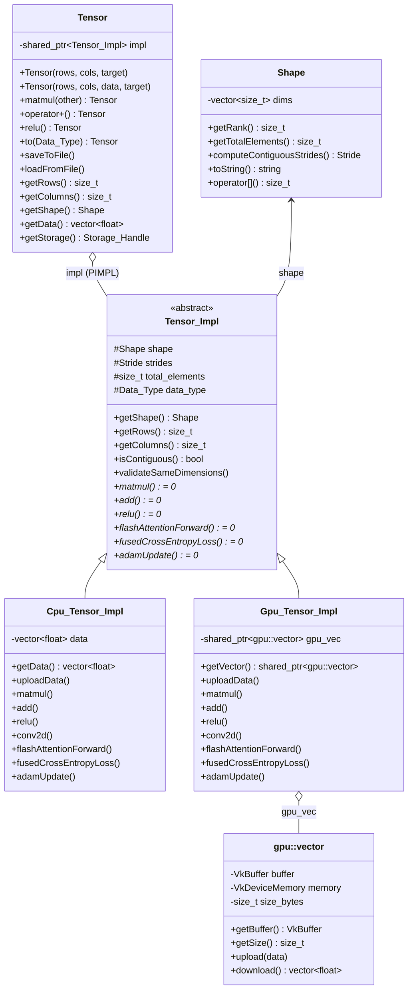
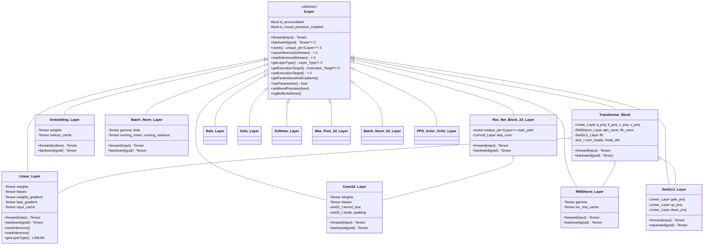
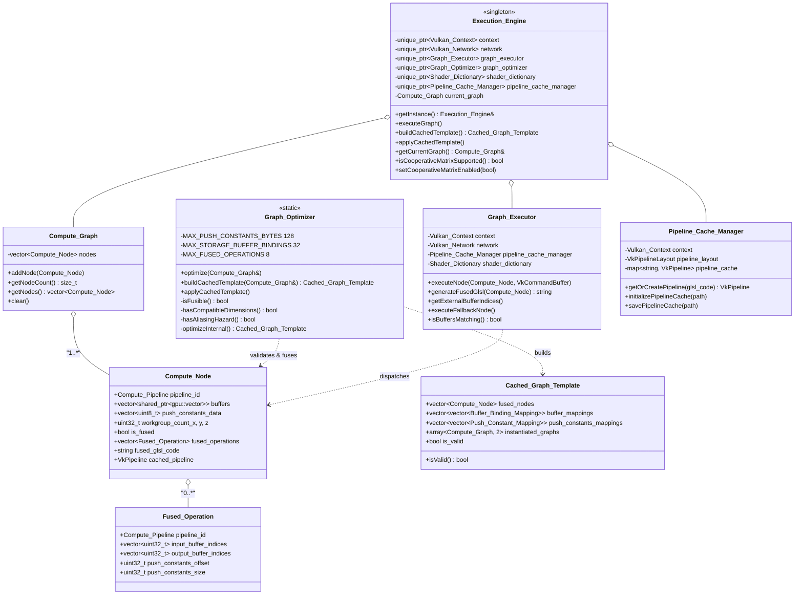
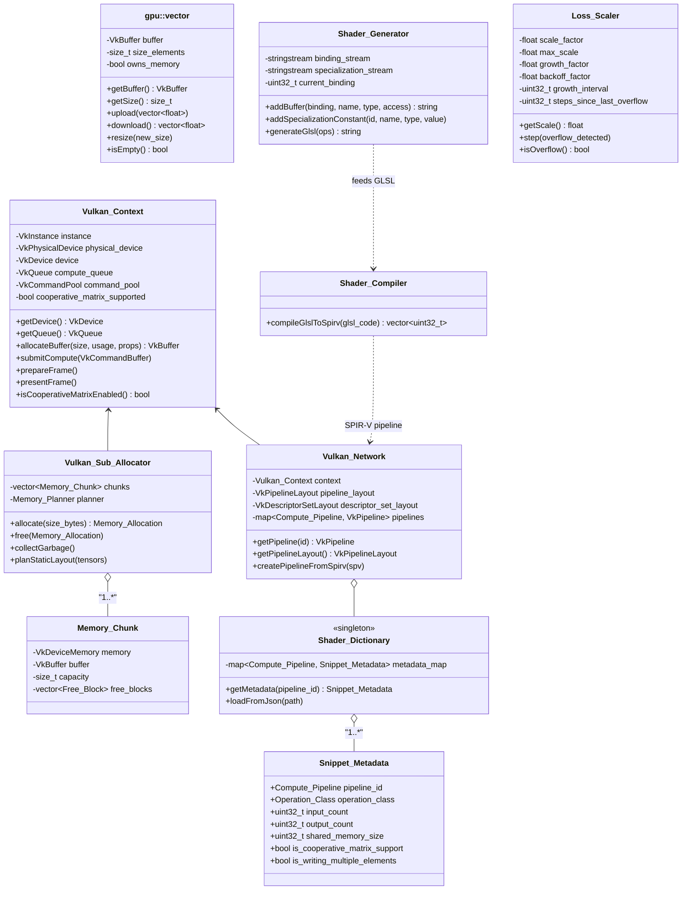
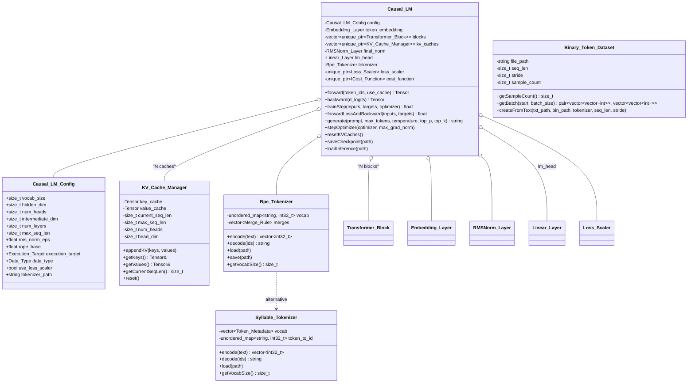
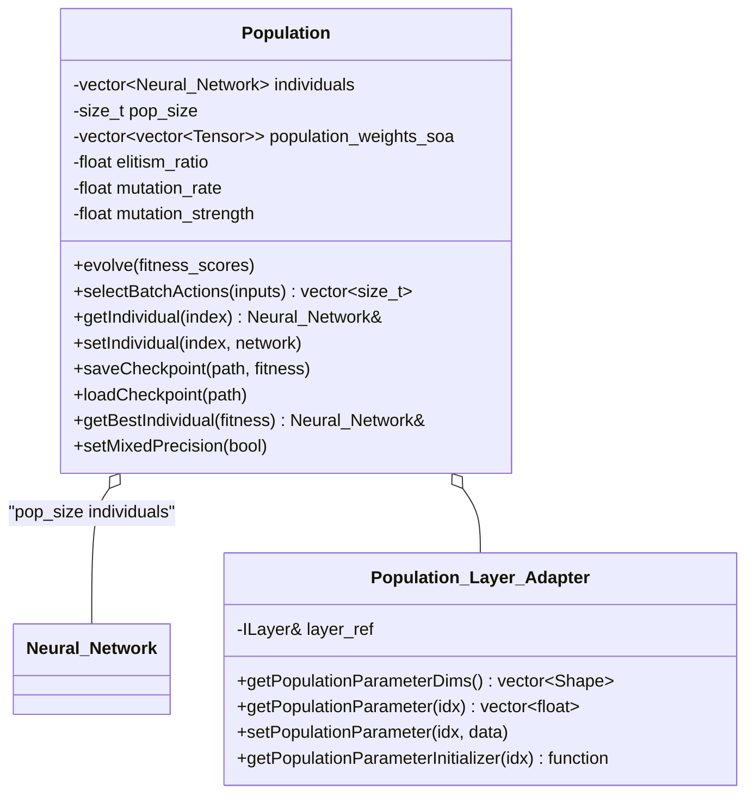
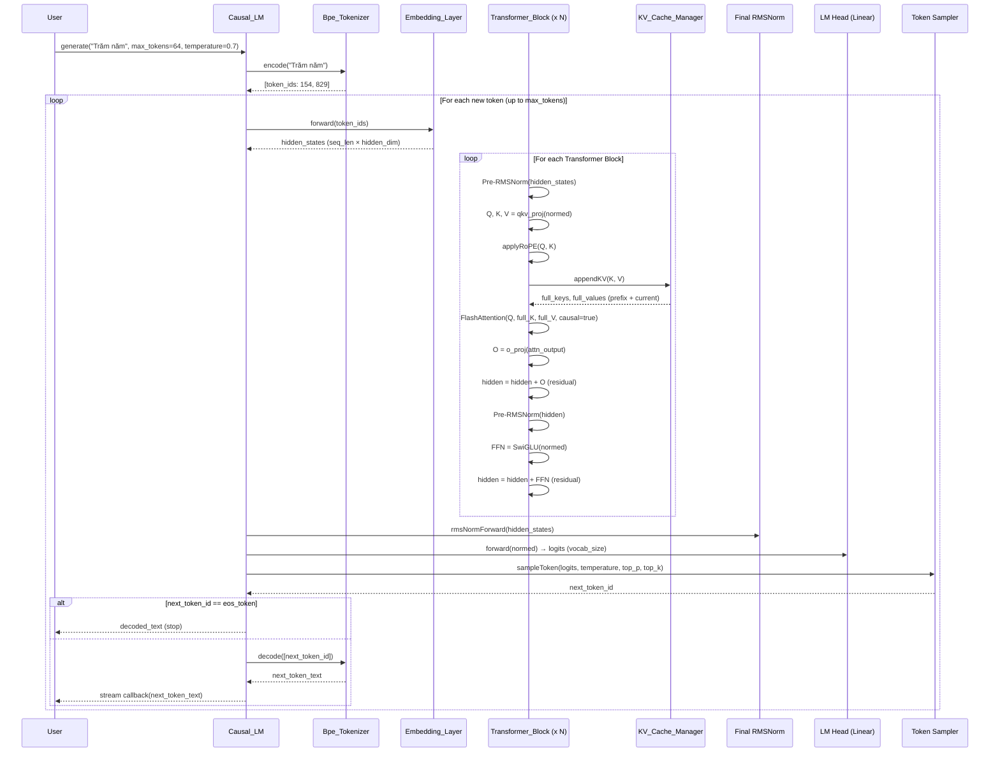
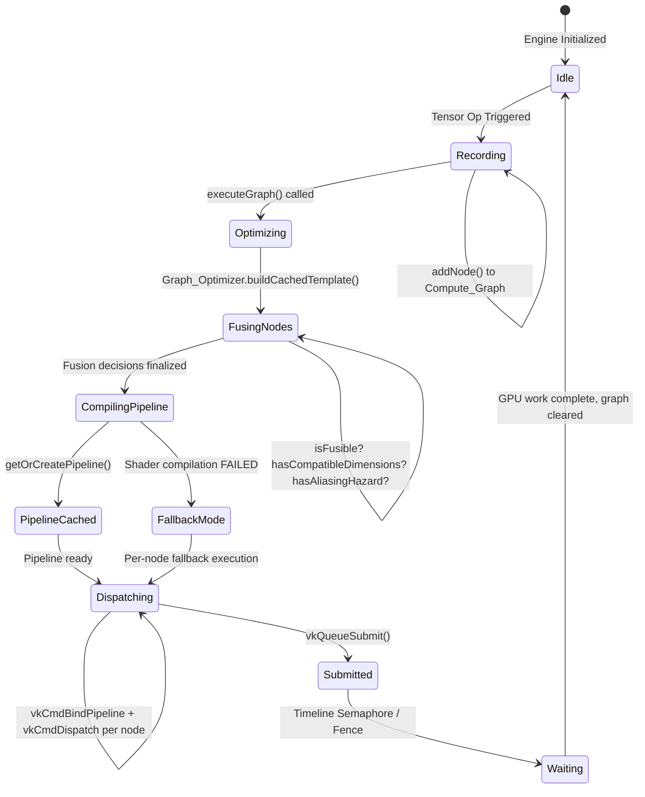

# VulkanML — Sơ đồ Kiến trúc UML Chi tiết

## 1. Architecture Layering Diagram

```mermaid
graph TD
    subgraph L6["Layer 6 — Application & High-Level Models"]
        NN["Neural_Network\n(Sequential Model + Training Loop)"]
        POP["Population\n(Neuroevolution + Batched GPU GEMM)"]
        TC["Training_Context\n(Layer Factory + Optimizer Factory)"]
        LLM["Causal_LM\n(Decoder-only Transformer LLM)"]
        RL["DQN / PPO Agents\n(Replay Buffer + CartPole Env)"]
    end

    subgraph L5["Layer 5 — Tokenizers"]
        BPE["Bpe_Tokenizer\n(Byte-Pair Encoding)"]
        SYL["Syllable_Tokenizer\n(Vietnamese Syllable)"]
        VNP["Vietnamese_Phonetics\n(Tone + Rhyme Analysis)"]
    end

    subgraph L4["Layer 4 — Concrete Neural Layers"]
        LIN["Linear_Layer\n(Dense + Adam Fused)"]
        CONV["Conv2d_Layer"]
        BN["BatchNorm 1D/2D"]
        RMSN["RMSNorm_Layer"]
        SWIGLU["SwiGLU_Layer"]
        EMB["Embedding_Layer"]
        TRB["Transformer_Block\n(QKV + FlashAttention + FFN)"]
        ACT["ReLU / GELU / Softmax"]
        POOL["MaxPool2D / GlobalAvgPool2D"]
        RES["ResNet Block / ResNet-20"]
        PPO_L["PPO_Actor_Critic_Layer"]
    end

    subgraph L4i["Layer 4 — Loss / Optimizer / LR"]
        COST["ICost_Function\n(MSE / MAE / BCE / CCE / Huber / Fused_CCE)"]
        OPT["IOptimizer\n(Adam / SGD)"]
        LRS["ILearning_Rate\n(Cosine / Step / Plateau / Exp / Poly)"]
        IL["ILayer\n(Abstract Base)"]
    end

    subgraph L3["Layer 3 — Tensor & Math System"]
        TENS["Tensor\n(Public API)"]
        SHP["Shape + Stride"]
        CPU_IMPL["Cpu_Tensor_Impl\n(~2800 lines CPU ops)"]
        GPU_IMPL["Gpu_Tensor_Impl\n(~3100 lines GPU dispatch)"]
        TIMPL["Tensor_Impl\n(Abstract Interface)"]
    end

    subgraph L2["Layer 2 — Graph & Execution Engine"]
        EE["Execution_Engine\n(Singleton, Graph Lifecycle)"]
        GO["Graph_Optimizer\n(JIT Fusion + Aliasing Hazard)"]
        GX["Graph_Executor\n(Vulkan Dispatch + Static Buffer)"]
        CG["Compute_Graph\n(DAG of Compute_Node)"]
        LS["Loss_Scaler\n(FP16 AMP)"]
        ADP["Async_Data_Pipeline\n(Double Buffer)"]
    end

    subgraph L1["Layer 1 — Vulkan Core Engine"]
        VK["Vulkan_Context\n(Device + Queue + Swapchain)"]
        NET["Vulkan_Network\n(Pipeline Layout + Descriptor Pool)"]
        ALLOC["Vulkan_Sub_Allocator\n(Memory Pool)"]
        GPUV["gpu::vector\n(GPU Buffer RAII)"]
        SHAD["Shader_Dictionary\n(JSON Metadata)"]
        SHGEN["Shader_Generator\n(Runtime GLSL)"]
        SHCOMP["Shader_Compiler\n(glslc / shaderc)"]
        PCM["Pipeline_Cache_Manager\n(On-disk VkPipeline Cache)"]
    end

    subgraph L0["Layer 0 — Utilities & Helpers"]
        LOG["Logger\n(Feature-masked Async)"]
        UPREFS["User_Preferences\n(JSON Config)"]
        PROF["Training_Profiler\n(Step Timings)"]
    end

    L6 --> L5
    L6 --> L4
    L6 --> L4i
    L4 --> L3
    L4i --> L3
    L3 --> L2
    L2 --> L1
    L1 --> L0
```



---

## 2. Class Diagram — Tensor System



---

## 3. Class Diagram — Layer System



---

## 4. Class Diagram — Execution Engine & Graph Optimization



---

## 5. Class Diagram — Vulkan Core Engine



---

## 6. Class Diagram — Neural Network & Training Context

```mermaid
classDiagram
    class Neural_Network {
        -vector~unique_ptr~ILayer~~ layers
        -unique_ptr~IOptimizer~ optimizer
        -unique_ptr~ICost_Function~ cost_function
        -unique_ptr~ILearning_Rate~ learning_rate
        -unique_ptr~Loss_Scaler~ loss_scaler
        -Execution_Target execution_target
        -bool is_training_mode
        +addLayer()
        +forward(input) Tensor
        +backward(grad) Tensor
        +trainStep(input, target) float
        +fit(dataset, epochs)
        +compileAndWarmup(batch, in_dim, out_dim)
        +saveInference(path)
        +loadInference(path)
        +saveTrainingCheckpoint(path)
        +loadTrainingCheckpoint(path)
        +setMixedPrecision(bool)
    }

    class Training_Context {
        -unique_ptr~IOptimizer~ optimizer
        -unique_ptr~ILearning_Rate~ learning_rate
        -unique_ptr~ICost_Function~ cost_function
        +constructLayerFromConfig(type, stream) ILayer*
        +createCostFunction(type) ICost_Function*
        +createOptimizer(type) IOptimizer*
        +createLearningRateScheduler(type) ILearning_Rate*
    }

    class IOptimizer {
        <<abstract>>
        +step(param_grad_pairs)*= 0
        +saveCheckpoint(ofstream)*= 0
        +loadCheckpoint(ifstream)*= 0
        +getLearningRate() float*= 0
        +getType() Optimizer_Type*= 0
        +setLearningRate(float)*= 0
    }

    class Adam_Optimizer {
        -float learning_rate
        -float beta1, beta2, epsilon
        -float weight_decay
        -size_t timestep
        -map~Tensor*, Parameter_State~ states
        +step(param_grad_pairs)
        +saveCheckpoint()
        +loadCheckpoint()
    }

    class Sgd_Optimizer {
        -float learning_rate
        -float max_gradient
        +step(param_grad_pairs)
    }

    class ILearning_Rate {
        <<abstract>>
        +updateRate() float*= 0
        +step(current_value)*= 0
        +getCurrentRate() float*= 0
        +saveCheckpoint()*= 0
    }

    class ICost_Function {
        <<abstract>>
        +computeLoss(pred, target) float*= 0
        +computeGradient(pred, target) Tensor*= 0
        +isFused() bool
        +supportsIntegerTargets() bool
        +getType() Cost_Type*= 0
    }

    class Fused_Cross_Entropy {
        -int32_t ignore_index
        +computeLoss(pred, target) float
        +computeGradient(pred, target) Tensor
        +computeLossAndGradient(logits, integer_targets, d_logits) float
        +isFused() true
        +supportsIntegerTargets() true
    }

    Neural_Network o-- ILayer : "0..*"
    Neural_Network o-- IOptimizer
    Neural_Network o-- ICost_Function
    Neural_Network o-- ILearning_Rate
    Neural_Network o-- Loss_Scaler
    Training_Context ..> ILayer : constructs
    Training_Context ..> IOptimizer : constructs
    Training_Context ..> ICost_Function : constructs
    IOptimizer <|-- Adam_Optimizer
    IOptimizer <|-- Sgd_Optimizer
    ICost_Function <|-- Fused_Cross_Entropy
    ICost_Function <|-- Mse_Cost
    ICost_Function <|-- Mae_Cost
    ICost_Function <|-- Bce_Cost
    ICost_Function <|-- Cce_Cost
    ICost_Function <|-- Huber_Cost
    ILearning_Rate <|-- Cosine_Annealing
    ILearning_Rate <|-- Step_Decay
    ILearning_Rate <|-- Multi_Step_Decay
    ILearning_Rate <|-- Exponential_Decay
    ILearning_Rate <|-- Polynomial_Decay
    ILearning_Rate <|-- Reduce_On_Plateau
    ILearning_Rate <|-- No_Decay
```



---

## 7. Class Diagram — LLM & Tokenizer Subsystem



---

## 8. Class Diagram — Population (Neuroevolution)



---

## 9. Sequence Diagram — Operator Fusion Pipeline (JIT)

```mermaid
sequenceDiagram
    participant User
    participant Tensor
    participant EE as Execution_Engine
    participant CG as Compute_Graph
    participant GO as Graph_Optimizer
    participant GX as Graph_Executor
    participant PCM as Pipeline_Cache_Manager
    participant SG as Shader_Generator
    participant VK as Vulkan_Context

    User->>Tensor: mat_a + mat_b (ADD node)
    Tensor->>CG: addNode(ADD_compute_node)
    User->>Tensor: result.relu() (RELU node)
    Tensor->>CG: addNode(RELU_compute_node)

    User->>EE: executeGraph()
    EE->>GO: buildCachedTemplate(current_graph)

    GO->>GO: isFusible(ELEMENTWISE, ELEMENTWISE)?
    GO->>GO: hasCompatibleDimensions(ADD, RELU)?
    GO->>GO: hasAliasingHazard(ADD, RELU)?
    Note over GO: All checks PASS → Fuse!

    GO-->>EE: Cached_Graph_Template {fused_node[ADD+RELU]}

    EE->>PCM: getOrCreatePipeline(fused_glsl_code)
    alt Pipeline NOT in cache
        PCM->>SG: generateFusedGlsl(fused_operations)
        SG-->>PCM: "void main() { add(); relu(); }"
        PCM->>PCM: compileGlslToSpirv()
        PCM->>VK: vkCreateComputePipeline()
        PCM-->>EE: VkPipeline (new)
    else Pipeline IN cache
        PCM-->>EE: VkPipeline (cached)
    end

    EE->>GX: executeNode(fused_node, cmd_buffer)
    GX->>VK: vkCmdBindPipeline(fused_pipeline)
    GX->>VK: vkCmdBindDescriptorSets(buffers)
    GX->>VK: vkCmdPushConstants(ADD_params + RELU_params)
    GX->>VK: vkCmdDispatch(workgroups)
    EE->>VK: vkQueueSubmit()
    EE-->>User: Result tensors ready
```

---

## 10. Sequence Diagram — LLM Token Generation (Autoregressive + KV Cache)



---

## 11. State Diagram — Execution Engine Graph Lifecycle


