# VulkanML — Sơ đồ Kiến trúc UML Chi tiết

## 1. Architecture Layering Diagram (Phân tầng Kiến trúc)

```mermaid
graph TD
    subgraph L6["Layer 6 — Application & High-Level Models"]
        NN["Neural_Network\n(Sequential Model, Training Loop & Checkpoints)"]
        POP["Population\n(Neuroevolution, SoA Batched GPU GEMM)"]
        TC["Training_Context\n(Epoch State, Optimizer, Loss & Scheduler Management)"]
        LLM["Causal_LM\n(Decoder-only Transformer LLM & Generation Loop)"]
        RL["RL Agents\n(DQN Agent, PPO Agent, Replay Buffer, CartPole Env)"]
    end

    subgraph L5["Layer 5 — Tokenizers & Phonetics"]
        BPE["Bpe_Tokenizer\n(Byte-Pair Encoding, HuggingFace JSON Compatible)"]
        SYL["Syllable_Tokenizer\n(Vietnamese Syllable Segmentation & Rhyme Matching)"]
        VNP["Vietnamese_Phonetics\n(Tone Analysis: Bằng/Trắc, Rhyme Family)"]
    end

    subgraph L4["Layer 4 — Concrete Neural Layers & Operators"]
        LIN["Linear_Layer\n(Dense GEMM + Adam Fused Backward)"]
        CONV["Conv2d_Layer\n(Im2Col / Direct GEMM)"]
        BN["BatchNorm 1D & 2D\n(Running Mean/Variance)"]
        RMSN["RMSNorm_Layer\n(Root Mean Square Normalization)"]
        SWIGLU["SwiGLU_Layer\n(Swish-Gated Activation Layer)"]
        EMB["Embedding_Layer\n(Token Lookup & Grad Accumulation)"]
        TRB["Transformer_Block\n(Pre-RMSNorm + RoPE + FlashAttention + SwiGLU FFN)"]
        ACT["Activation Layers\n(ReLU, GELU, Softmax)"]
        POOL["Pooling Layers\n(MaxPool2D, GlobalAvgPool2D)"]
        RES["Residual Networks\n(Res_Net_Block_2d_Layer, Res_Net_20_Layer)"]
        PPO_L["PPO_Actor_Critic_Layer\n(Actor Policy + Critic Value Heads)"]
    end

    subgraph L4i["Layer 4 — Loss Functions, Optimizers & Schedulers"]
        COST["ICost_Function\n(MSE, MAE, BCE, CCE, Huber, Fused_Cross_Entropy)"]
        OPT["IOptimizer\n(Adam_Optimizer with AMP & Weight Decay, Sgd_Optimizer)"]
        LRS["ILearning_Rate\n(Cosine_Annealing, Step, Exponential, Polynomial, Plateau)"]
        IL["ILayer\n(Abstract Base Class)"]
    end

    subgraph L3["Layer 3 — Tensor & Math Abstraction System"]
        TENS["Tensor\n(Public PIMPL API, Strides, Slicing & Serialization)"]
        SHP["Shape & Stride\n(Static Array Dims up to Rank 6)"]
        CPU_IMPL["Cpu_Tensor_Impl\n(AVX/CPU Math Implementations)"]
        GPU_IMPL["Gpu_Tensor_Impl\n(Vulkan Compute Kernels, FlashAttention, RoPE)"]
        TIMPL["Tensor_Impl\n(Abstract Interface)"]
    end

    subgraph L2["Layer 2 — Graph Optimization & Execution Engine"]
        EE["Execution_Engine\n(Singleton, Graph Cache, Double-Buffered Frames)"]
        GO["Graph_Optimizer\n(Static JIT Fusion Validation & Hazard Analysis)"]
        GX["Graph_Executor\n(Vulkan Command Dispatch, Static Buffers, Fallback)"]
        CG["Compute_Graph\n(DAG Container of Compute_Node)"]
        LS["Loss_Scaler\n(Dynamic Mixed Precision FP16 AMP)"]
        ADP["Async_Data_Pipeline\n(Double-Buffered Background Disk I/O)"]
    end

    subgraph L1["Layer 1 — Vulkan Core Compute Backend"]
        VK["Vulkan_Context\n(Physical/Logical Device, Compute Queue, Staging Buffers)"]
        NET["Vulkan_Network\n(Pipeline Layout, Descriptor Layout & Static Pipelines)"]
        ALLOC["Vulkan_Sub_Allocator\n(Device Memory Chunk Pool & Dynamic Blocks)"]
        GPUV["gpu_vector\n(RAII GPU Buffer with Sub-Allocation)"]
        SHAD["Shader_Dictionary\n(Snippet JSON Metadata & Fusion Capabilities)"]
        SHGEN["Shader_Generator\n(Dynamic GLSL Stitching for Operator Fusion)"]
        SHCOMP["Shader_Compiler\n(glslc / libshaderc SPIR-V Compilation)"]
        PCM["Pipeline_Cache_Manager\n(On-disk & In-memory VkPipeline Cache)"]
    end

    subgraph L0["Layer 0 — Foundation Utilities & Profiling"]
        LOG["Logger\n(Feature-Masked Logging & Timestamps)"]
        UPREFS["User_Preferences\n(JSON Preferences & Device Config)"]
        PROF["Training_Profiler\n(Stage Timing Accumulators)"]
    end

    L6 --> L5
    L6 --> L4
    L6 --> L4i
    L4 --> L3
    L4i --> L3
    L3 --> L2
    L2 --> L1
    L1 --> L0
```

---

## 2. Class Diagram — Tensor System (Hệ thống Tensor)

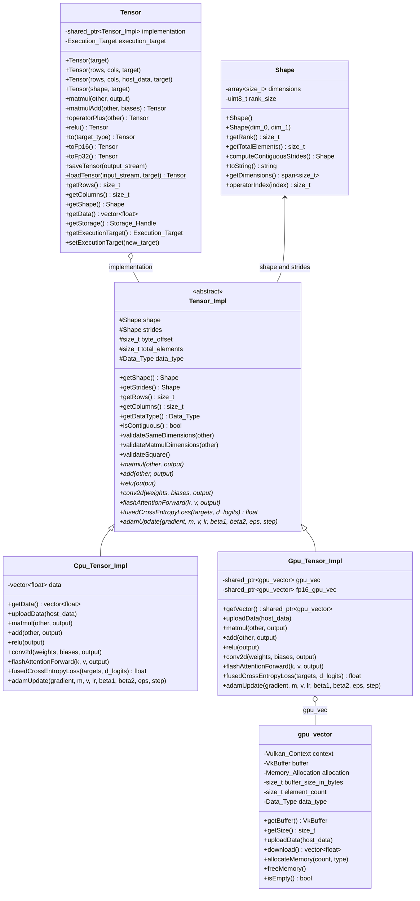

---

## 3. Class Diagram — Layer System (Hệ thống Lớp Nơ-ron)

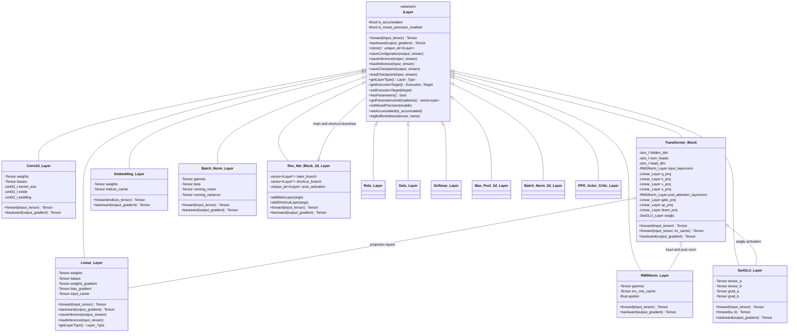

---

## 4. Class Diagram — Execution Engine & Graph Optimization (Đồ thị & Tối ưu hóa)

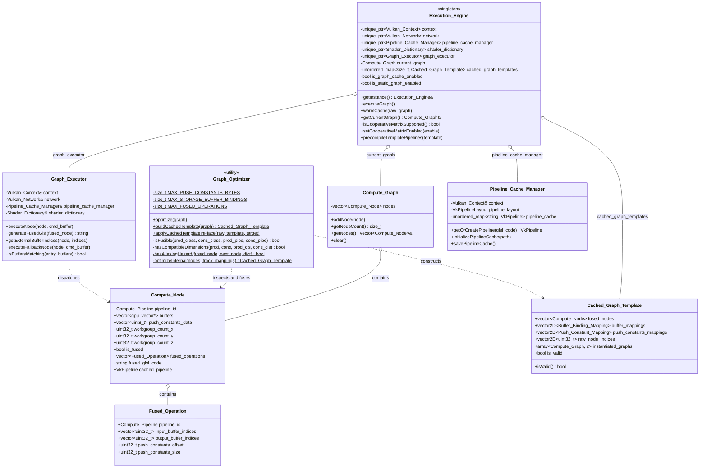

---

## 5. Class Diagram — Vulkan Core Engine (Tầng Lõi Vulkan)

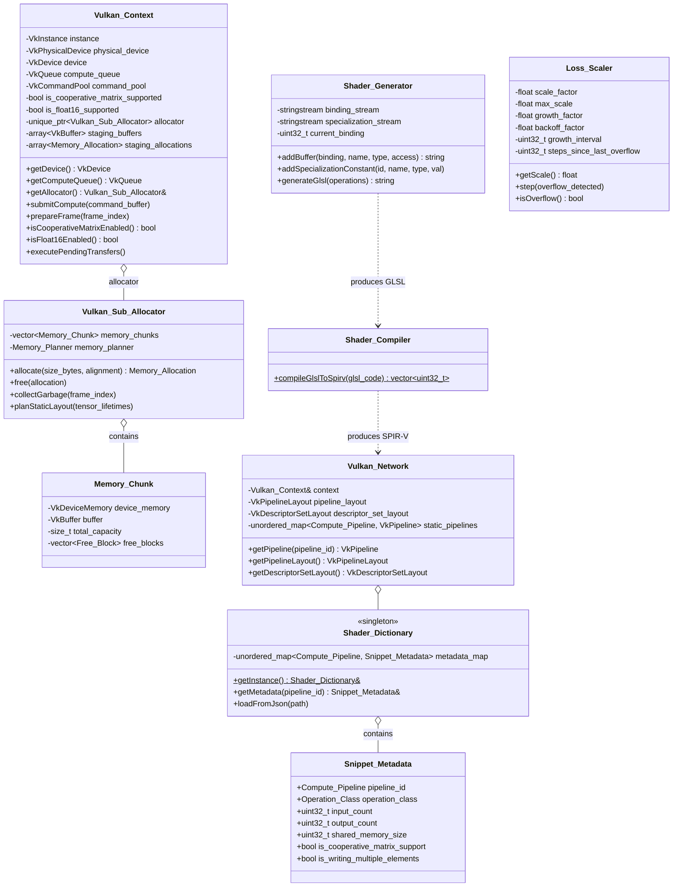

---

## 6. Class Diagram — Neural Network & Training Context (Mô hình & Quản lý Huấn luyện)

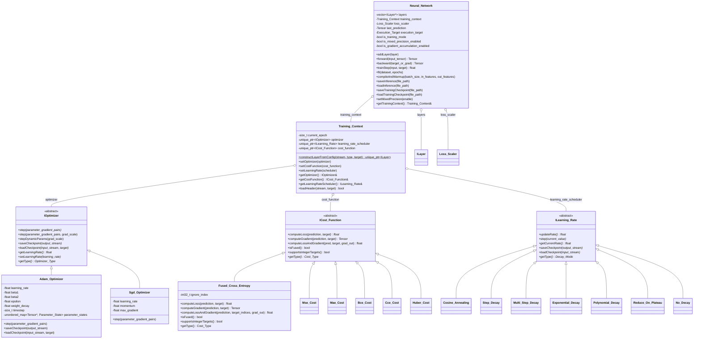

---

## 7. Class Diagram — LLM & Tokenizer Subsystem (Phân hệ Ngôn ngữ & Tokenizer)

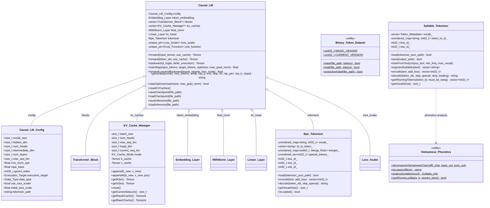

---

## 8. Class Diagram — Population & Neuroevolution (Tiến hóa Nơ-ron)

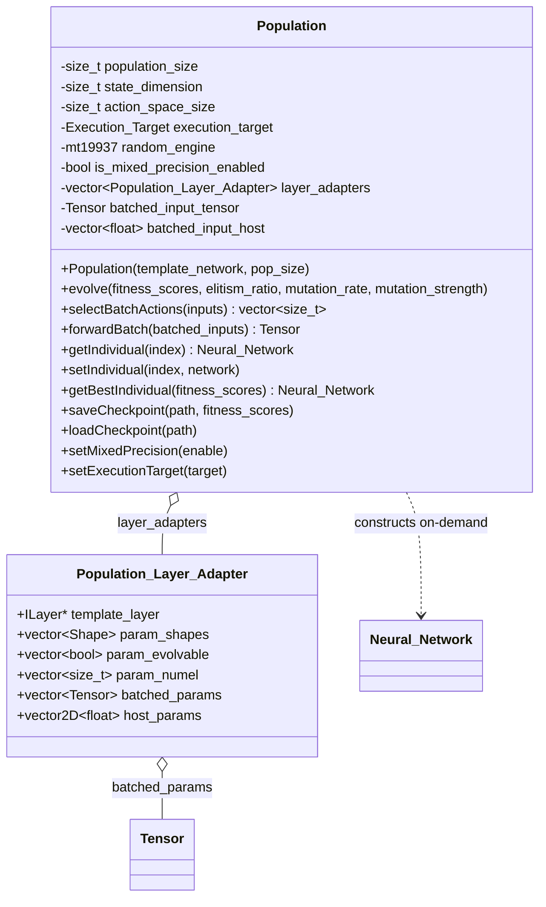

---

## 9. Sequence Diagram — JIT Operator Fusion Pipeline (Ghép Toán tử Đồ thị)

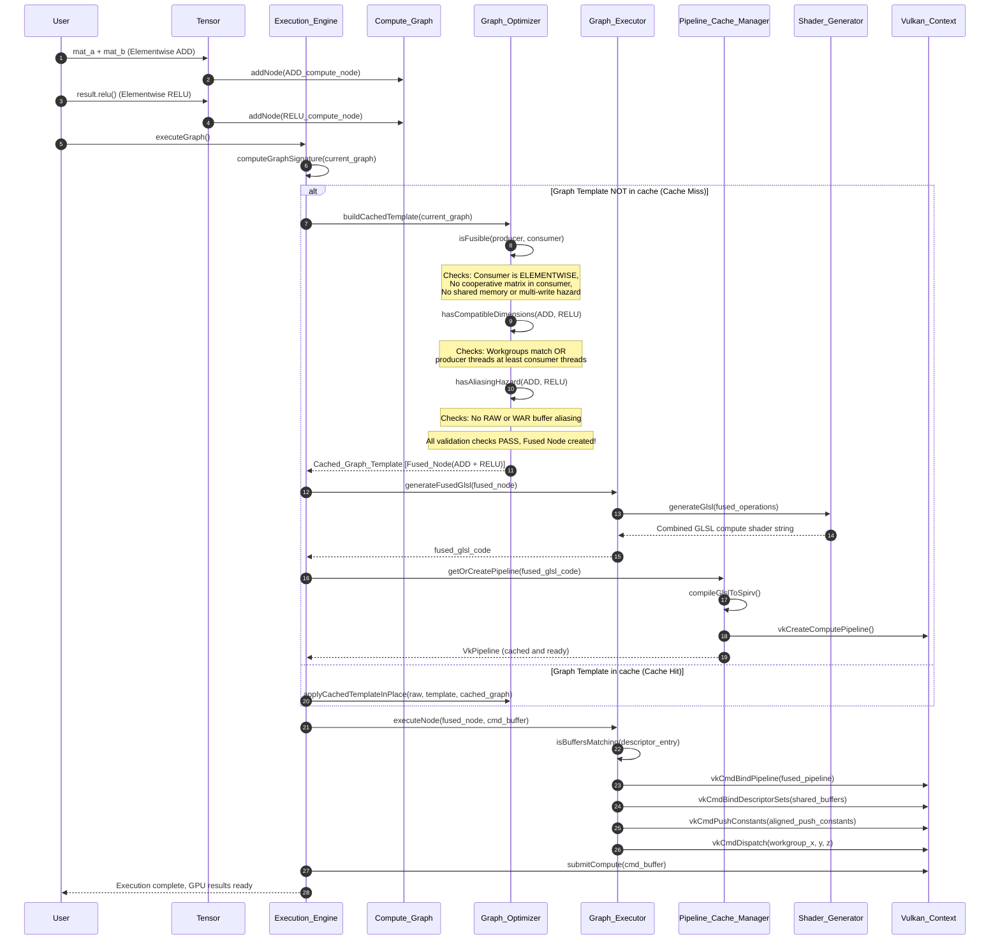

---

## 10. Sequence Diagram — LLM Autoregressive Generation (Sinh Token & KV Cache)

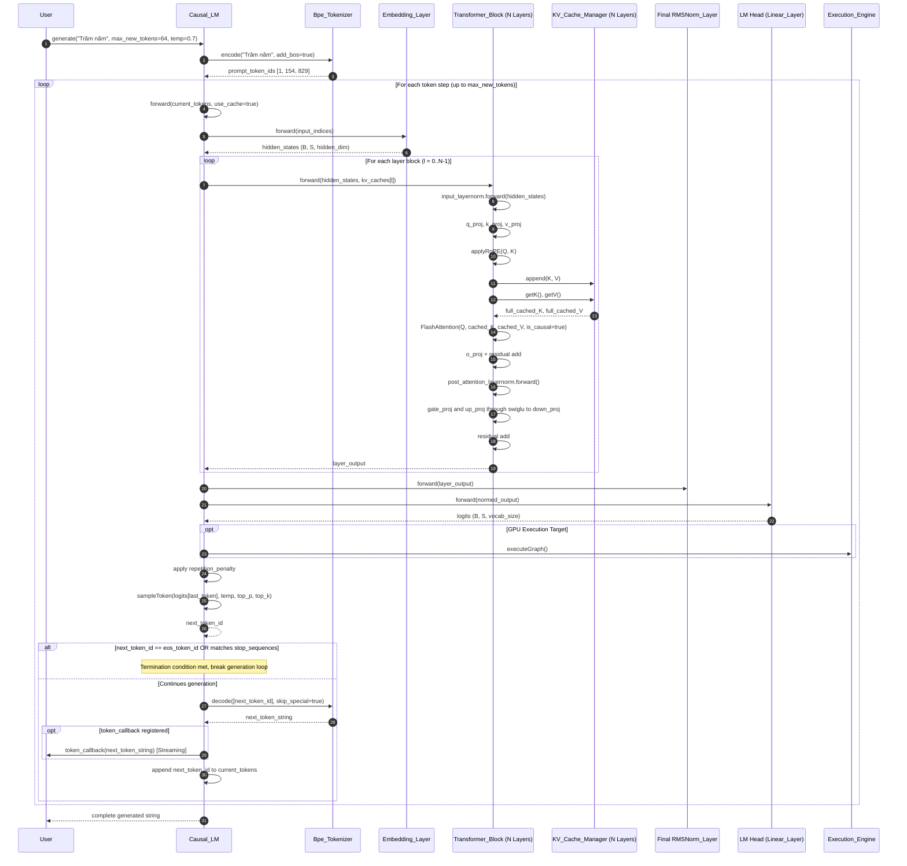

---

## 11. State Diagram — Execution Engine Graph Lifecycle (Vòng đời Đồ thị Tính toán)

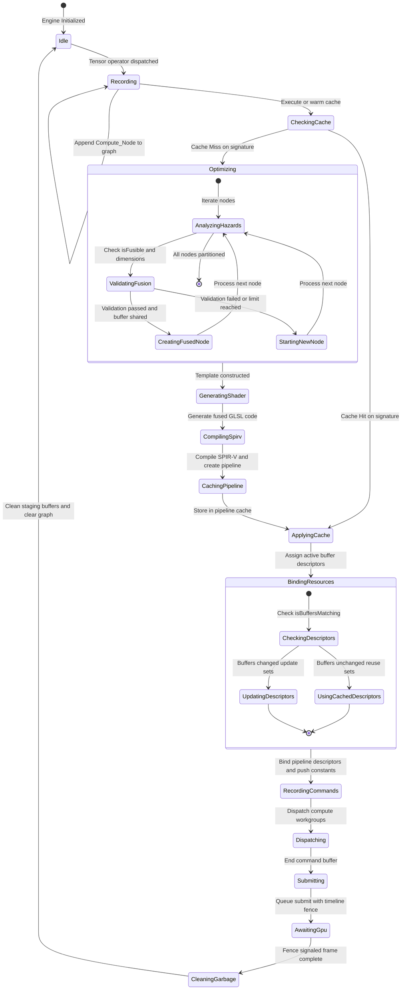
